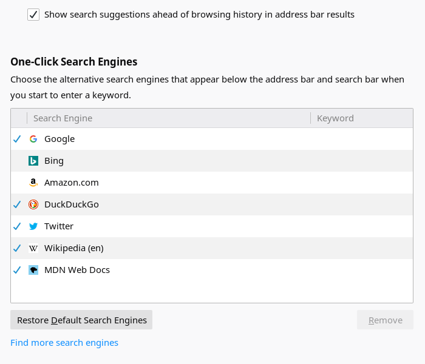
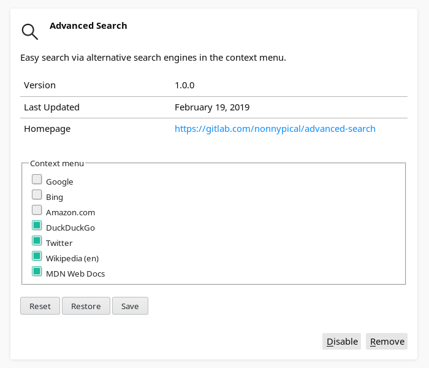
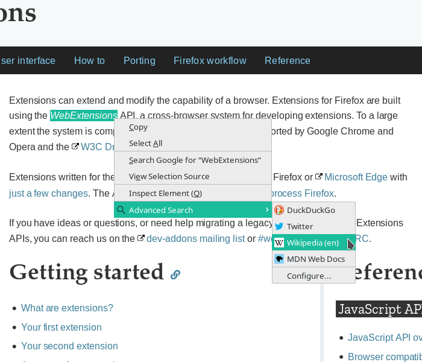

# Advanced Search

Easy search via alternative search engines in the context menu.

## Description

Advanced Search is a browser extension for Firefox which adds the installed search engines to the context menu and thus allows an easy search via an alternative search engine.

* Manage search engines in the preferences page.  
  

* Select search engines to be shown in the context menu.  
  

* Right-click the selection or link and select the search engine.  
  

## Installation

This browser extension can be install from the [Mozilla Add-ons store](https://addons.mozilla.org/firefox/addon/nonnypical-advanced-search/).

## License

This project is released under the Mozilla Public License Version 2.0.
See the LICENSE-MPLv2.0 file in this directory for complete text.

The icon is licensed under the GNU Lesser General Public License Version 3.
See the LICENSE-LGPLv3 file in this directory for complete text.

## Credits

This project uses a modified icon from the [KDE BreezeIcons project](https://api.kde.org/frameworks/breeze-icons/html/index.html) which is released under the GNU Lesser General Public License Version 3.
